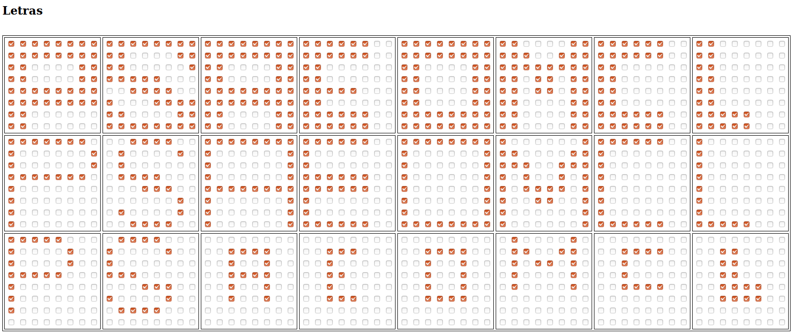

# Práctica 02

Alumnos:

- Aguilar Enriquez, Paul Sebastian
- Cabrera Lopez, Oscar Emilio

## Algoritmo

- Reconocedor de letras

## Ejecución

### Creación de los datos

Se tiene un archivo llamado `crearCaracteres.html`, el cual sirve como interfaz para crear las matrices de entrada y salida para trabajar con la red neuronal.

Se debe abrir el archivo `crearCaracteres.html` y seguir las instrucciones que se dejan a continuación:

- Ingresar la cantidad de letras deseadas, por las instrucciones de la practica deben de ser 8 letras, 4 por cada integrante.
- Ingresar la cantidad de variantes de cada set de datos, digamos una tipografía diferente para grupo de letras.
- Las letras se deben ingresar de manera horizontal.
- Las variantes de las letras se añaden de manera vertical.
- Suponiendo que las siguientes tres lineas tienen tipografía distinta, tendríamos 8 letras con tres variantes, deberían ingresarse de la siguiente manera en las mallas.
 - PSAEOMCL
 - PSAEOMCL
 - PSAEOMCL

Una vez ingresados los datos en los campos correspondientes, el archivo `gui.js` se encargara de crear una serie de mallas en las cuales se pueden crear las letras siguiente las instrucciones previas.

Para la prueba se utilizo el siguiente diseño:

Y los vectores que se generaron fueron los siguientes:



Las letras utilizadas son las iniciales de nuestros nombres, excepto la M que es la segunda letra de eMilio dado que la E ya se había utilizado.

- Paul
- Sebastian
- Aguilar
- Enriquez
- Oscarl
- eMilio
- Cabrera
- Lopez

__Vector de entrada X__

```
X = [
[1,1,1,1,1,1,1,1,1,1,1,1,1,1,1,1,1,1,0,0,0,0,1,1,1,1,0,0,0,0,1,1,1,1,1,1,1,1,1,1,1,1,1,1,1,1,1,1,1,1,0,0,0,0,0,0,1,1,0,0,0,0,0,0],
[1,1,1,1,1,1,1,1,1,1,0,0,0,0,1,1,1,1,0,0,0,0,0,1,1,1,1,1,1,0,0,0,0,0,1,1,1,1,0,0,1,0,0,0,1,1,1,1,1,1,0,0,0,0,1,1,1,1,1,1,1,1,1,1],
[1,1,1,1,1,1,1,1,1,1,1,1,1,1,1,1,1,1,0,0,0,0,1,1,1,1,0,0,0,0,1,1,1,1,1,1,1,1,1,1,1,1,1,1,1,1,1,1,1,1,0,0,0,0,1,1,1,1,0,0,0,0,1,1],
[1,1,1,1,1,1,0,0,1,1,1,1,1,1,0,0,1,1,0,0,0,0,0,0,1,1,0,0,0,0,0,0,1,1,1,1,1,0,0,0,1,1,0,0,0,0,0,0,1,1,1,1,1,1,0,0,1,1,1,1,1,1,0,0],
[1,1,1,1,1,1,1,1,1,1,1,1,1,1,1,1,1,1,0,0,0,0,1,1,1,1,0,0,0,0,1,1,1,1,0,0,0,0,1,1,1,1,0,0,0,0,1,1,1,1,1,1,1,1,1,1,1,1,1,1,1,1,1,1],
[1,1,0,0,0,0,1,1,1,1,1,0,0,1,1,1,1,1,1,1,1,1,1,1,1,1,0,1,1,0,1,1,1,1,0,1,1,0,1,1,1,1,0,0,0,0,1,1,1,1,0,0,0,0,1,1,1,1,0,0,0,0,1,1],
[1,1,1,1,1,1,0,0,1,1,1,1,1,1,0,0,1,1,0,0,0,0,0,0,1,1,0,0,0,0,0,0,1,1,0,0,0,0,0,0,1,1,0,0,0,0,0,0,1,1,1,1,1,1,0,0,1,1,1,1,1,1,0,0],
[1,1,0,0,0,0,0,0,1,1,0,0,0,0,0,0,1,1,0,0,0,0,0,0,1,1,0,0,0,0,0,0,1,1,0,0,0,0,0,0,1,1,0,0,0,0,0,0,1,1,1,1,1,0,0,0,1,1,1,1,1,0,0,0],
[1,1,1,1,1,1,1,0,1,0,0,0,0,0,0,1,1,0,0,0,0,0,0,1,1,1,1,1,1,1,1,0,1,0,0,0,0,0,0,0,1,0,0,0,0,0,0,0,1,0,0,0,0,0,0,0,1,0,0,0,0,0,0,0],
[0,0,1,1,1,1,0,0,0,1,0,0,0,0,1,0,0,1,0,0,0,0,0,0,0,1,1,1,1,0,0,0,0,0,0,1,1,1,0,0,0,0,0,0,0,0,1,0,0,1,0,0,0,0,1,0,0,0,1,1,1,1,0,0],
[1,1,1,1,1,1,1,1,1,0,0,0,0,0,0,1,1,0,0,0,0,0,0,1,1,0,0,0,0,0,0,1,1,1,1,1,1,1,1,1,1,0,0,0,0,0,0,1,1,0,0,0,0,0,0,1,1,0,0,0,0,0,0,1],
[1,1,1,1,1,1,0,0,1,0,0,0,0,0,0,0,1,0,0,0,0,0,0,0,1,1,1,1,1,1,0,0,1,1,1,1,1,1,0,0,1,0,0,0,0,0,0,0,1,0,0,0,0,0,0,0,1,1,1,1,1,1,0,0],
[1,1,1,1,1,1,1,1,1,0,0,0,0,0,0,1,1,0,0,0,0,0,0,1,1,0,0,0,0,0,0,1,1,0,0,0,0,0,0,1,1,0,0,0,0,0,0,1,1,0,0,0,0,0,0,1,1,1,1,1,1,1,1,1],
[1,0,0,0,0,0,0,1,1,1,0,0,0,0,1,1,1,1,1,0,0,1,1,1,1,0,1,0,0,1,0,1,1,0,1,1,1,1,0,1,1,0,0,1,1,0,0,1,1,0,0,0,0,0,0,1,1,0,0,0,0,0,0,1],
[1,1,1,1,1,1,0,0,1,0,0,0,0,0,0,0,1,0,0,0,0,0,0,0,1,0,0,0,0,0,0,0,1,0,0,0,0,0,0,0,1,0,0,0,0,0,0,0,1,0,0,0,0,0,0,0,1,1,1,1,1,1,0,0],
[1,0,0,0,0,0,0,0,1,0,0,0,0,0,0,0,1,0,0,0,0,0,0,0,1,0,0,0,0,0,0,0,1,0,0,0,0,0,0,0,1,0,0,0,0,0,0,0,1,0,0,0,0,0,0,0,1,1,1,1,1,0,0,0],
[1,1,1,1,1,0,0,0,1,0,0,0,0,1,0,0,1,0,0,0,0,1,0,0,1,1,1,1,1,0,0,0,1,0,0,0,0,0,0,0,1,0,0,0,0,0,0,0,1,0,0,0,0,0,0,0,0,0,0,0,0,0,0,0],
[0,1,1,1,1,0,0,0,1,0,0,0,0,1,0,0,1,0,0,0,0,0,0,0,1,1,1,0,0,0,0,0,0,0,0,1,1,1,0,0,1,0,0,0,0,1,0,0,0,1,1,1,1,0,0,0,0,0,0,0,0,0,0,0],
[0,0,0,0,0,0,0,0,0,0,1,1,1,1,0,0,0,0,1,0,0,1,0,0,0,0,1,1,1,1,0,0,0,0,1,0,0,1,0,0,0,0,1,0,0,1,0,0,0,0,0,0,0,0,0,0,0,0,0,0,0,0,0,0],
[0,0,0,0,0,0,0,0,0,0,1,1,1,0,0,0,0,0,1,0,0,0,0,0,0,0,1,1,0,0,0,0,0,0,1,0,0,0,0,0,0,0,1,1,1,0,0,0,0,0,0,0,0,0,0,0,0,0,0,0,0,0,0,0],
[0,0,0,0,0,0,0,0,0,0,1,1,1,1,0,0,0,0,1,0,0,1,0,0,0,0,1,0,0,1,0,0,0,0,1,0,0,1,0,0,0,0,1,1,1,1,0,0,0,0,0,0,0,0,0,0,0,0,0,0,0,0,0,0],
[0,1,0,0,0,0,1,0,0,1,1,0,0,1,1,0,0,1,0,1,1,0,1,0,0,1,0,0,0,0,1,0,0,1,0,0,0,0,1,0,0,0,0,0,0,0,0,0,0,0,0,0,0,0,0,0,0,0,0,0,0,0,0,0],
[0,0,0,0,0,0,0,0,0,0,1,1,1,1,0,0,0,0,1,0,0,0,0,0,0,0,1,0,0,0,0,0,0,0,1,1,1,1,0,0,0,0,0,0,0,0,0,0,0,0,0,0,0,0,0,0,0,0,0,0,0,0,0,0],
[0,0,0,0,0,0,0,0,0,0,1,1,0,0,0,0,0,0,1,1,0,0,0,0,0,0,1,1,0,0,0,0,0,0,1,1,1,1,0,0,0,0,1,1,1,1,0,0,0,0,0,0,0,0,0,0,0,0,0,0,0,0,0,0]
]
```

__Vector de salida Y__

```
Y = [
[1,0,0,0,0,0,0,0],
[0,1,0,0,0,0,0,0],
[0,0,1,0,0,0,0,0],
[0,0,0,1,0,0,0,0],
[0,0,0,0,1,0,0,0],
[0,0,0,0,0,1,0,0],
[0,0,0,0,0,0,1,0],
[0,0,0,0,0,0,0,1],
[1,0,0,0,0,0,0,0],
[0,1,0,0,0,0,0,0],
[0,0,1,0,0,0,0,0],
[0,0,0,1,0,0,0,0],
[0,0,0,0,1,0,0,0],
[0,0,0,0,0,1,0,0],
[0,0,0,0,0,0,1,0],
[0,0,0,0,0,0,0,1],
[1,0,0,0,0,0,0,0],
[0,1,0,0,0,0,0,0],
[0,0,1,0,0,0,0,0],
[0,0,0,1,0,0,0,0],
[0,0,0,0,1,0,0,0],
[0,0,0,0,0,1,0,0],
[0,0,0,0,0,0,1,0],
[0,0,0,0,0,0,0,1]
]
```
### Utilización de los datos

Estos vectores deben ser copiados y reemplazados dentro del script en python llamado `perceptron.py` en la sección correspondiente, para posteriormente ejecutar el script (la red) con estos datos.

La salida del script con los datos anteriores fue la siguiente:

```
$ python perceptron.py

Creamos una red neuronal con funcióón de activación hardlim, con 8 neuronas (son 8 clases) y 64 entradas (el vector es un flat de una matrix de 8x8)
Creamos el entrenador, utilizando dos terceras partes de los datos, un treshold de 0.1 y 10000 epocas
Datos de entrada para entrenamiento:
[[1. 1. 1. ... 0. 0. 0.]
 [1. 1. 1. ... 1. 1. 1.]
 [1. 1. 1. ... 0. 1. 1.]
 ...
 [1. 0. 0. ... 0. 0. 1.]
 [1. 1. 1. ... 1. 0. 0.]
 [1. 0. 0. ... 0. 0. 0.]]
Datos de salida para entrenamiento:
[[1. 0. 0. 0. 0. 0. 0. 0.]
 [0. 1. 0. 0. 0. 0. 0. 0.]
 [0. 0. 1. 0. 0. 0. 0. 0.]
 [0. 0. 0. 1. 0. 0. 0. 0.]
 [0. 0. 0. 0. 1. 0. 0. 0.]
 [0. 0. 0. 0. 0. 1. 0. 0.]
 [0. 0. 0. 0. 0. 0. 1. 0.]
 [0. 0. 0. 0. 0. 0. 0. 1.]
 [1. 0. 0. 0. 0. 0. 0. 0.]
 [0. 1. 0. 0. 0. 0. 0. 0.]
 [0. 0. 1. 0. 0. 0. 0. 0.]
 [0. 0. 0. 1. 0. 0. 0. 0.]
 [0. 0. 0. 0. 1. 0. 0. 0.]
 [0. 0. 0. 0. 0. 1. 0. 0.]
 [0. 0. 0. 0. 0. 0. 1. 0.]
 [0. 0. 0. 0. 0. 0. 0. 1.]]
Entrenamos
Epoch: 0 Error: 0.2734375
Epoch: 1 Error: 0.1875
Epoch: 2 Error: 0.078125
None
Probamos con el set de prueba, los elementos con 1 en el vector es la clase a la que corresponde, y desplegamos el error promedio de la red
Datos de entrada para test:
[[1. 1. 1. 1. 1. 0. 0. 0. 1. 0. 0. 0. 0. 1. 0. 0. 1. 0. 0. 0. 0. 1. 0. 0.
  1. 1. 1. 1. 1. 0. 0. 0. 1. 0. 0. 0. 0. 0. 0. 0. 1. 0. 0. 0. 0. 0. 0. 0.
  1. 0. 0. 0. 0. 0. 0. 0. 0. 0. 0. 0. 0. 0. 0. 0.]
 [0. 1. 1. 1. 1. 0. 0. 0. 1. 0. 0. 0. 0. 1. 0. 0. 1. 0. 0. 0. 0. 0. 0. 0.
  1. 1. 1. 0. 0. 0. 0. 0. 0. 0. 0. 1. 1. 1. 0. 0. 1. 0. 0. 0. 0. 1. 0. 0.
  0. 1. 1. 1. 1. 0. 0. 0. 0. 0. 0. 0. 0. 0. 0. 0.]
 [0. 0. 0. 0. 0. 0. 0. 0. 0. 0. 1. 1. 1. 1. 0. 0. 0. 0. 1. 0. 0. 1. 0. 0.
  0. 0. 1. 1. 1. 1. 0. 0. 0. 0. 1. 0. 0. 1. 0. 0. 0. 0. 1. 0. 0. 1. 0. 0.
  0. 0. 0. 0. 0. 0. 0. 0. 0. 0. 0. 0. 0. 0. 0. 0.]
 [0. 0. 0. 0. 0. 0. 0. 0. 0. 0. 1. 1. 1. 0. 0. 0. 0. 0. 1. 0. 0. 0. 0. 0.
  0. 0. 1. 1. 0. 0. 0. 0. 0. 0. 1. 0. 0. 0. 0. 0. 0. 0. 1. 1. 1. 0. 0. 0.
  0. 0. 0. 0. 0. 0. 0. 0. 0. 0. 0. 0. 0. 0. 0. 0.]
 [0. 0. 0. 0. 0. 0. 0. 0. 0. 0. 1. 1. 1. 1. 0. 0. 0. 0. 1. 0. 0. 1. 0. 0.
  0. 0. 1. 0. 0. 1. 0. 0. 0. 0. 1. 0. 0. 1. 0. 0. 0. 0. 1. 1. 1. 1. 0. 0.
  0. 0. 0. 0. 0. 0. 0. 0. 0. 0. 0. 0. 0. 0. 0. 0.]
 [0. 1. 0. 0. 0. 0. 1. 0. 0. 1. 1. 0. 0. 1. 1. 0. 0. 1. 0. 1. 1. 0. 1. 0.
  0. 1. 0. 0. 0. 0. 1. 0. 0. 1. 0. 0. 0. 0. 1. 0. 0. 0. 0. 0. 0. 0. 0. 0.
  0. 0. 0. 0. 0. 0. 0. 0. 0. 0. 0. 0. 0. 0. 0. 0.]
 [0. 0. 0. 0. 0. 0. 0. 0. 0. 0. 1. 1. 1. 1. 0. 0. 0. 0. 1. 0. 0. 0. 0. 0.
  0. 0. 1. 0. 0. 0. 0. 0. 0. 0. 1. 1. 1. 1. 0. 0. 0. 0. 0. 0. 0. 0. 0. 0.
  0. 0. 0. 0. 0. 0. 0. 0. 0. 0. 0. 0. 0. 0. 0. 0.]
 [0. 0. 0. 0. 0. 0. 0. 0. 0. 0. 1. 1. 0. 0. 0. 0. 0. 0. 1. 1. 0. 0. 0. 0.
  0. 0. 1. 1. 0. 0. 0. 0. 0. 0. 1. 1. 1. 1. 0. 0. 0. 0. 1. 1. 1. 1. 0. 0.
  0. 0. 0. 0. 0. 0. 0. 0. 0. 0. 0. 0. 0. 0. 0. 0.]]
Datos de salida para test:
[[1. 0. 0. 0. 0. 0. 0. 0.]
 [0. 1. 0. 0. 0. 0. 0. 0.]
 [0. 0. 1. 0. 0. 0. 0. 0.]
 [0. 0. 0. 1. 0. 0. 0. 0.]
 [0. 0. 0. 0. 1. 0. 0. 0.]
 [0. 0. 0. 0. 0. 1. 0. 0.]
 [0. 0. 0. 0. 0. 0. 1. 0.]
 [0. 0. 0. 0. 0. 0. 0. 1.]]
Resultados:
[array([0., 0., 0., 0., 0., 0., 0., 0.]), array([0., 1., 0., 0., 0., 0., 0., 0.]), array([-1.,  0.,  1., -1.,  0., -1., -1.,  0.]), array([-1.,  0., -1.,  0.,  0.,  0., -1.,  0.]), array([-1.,  0., -1., -1.,  1.,  0., -1.,  0.]), array([-1.,  0.,  0.,  0.,  0.,  0.,  0.,  0.]), array([ 0.,  0.,  0., -1.,  0.,  0.,  1.,  0.]), array([ 0.,  0., -1., -1.,  0., -1.,  0.,  1.])]
Error promedio de la red:
-0.171875
Pesos de la red:
[[-4.13138192e-01 -6.17772174e-01 -4.43298860e-01 -8.13655365e-01
  -5.72918233e-02 -4.23591323e-01  8.97856541e-01 -1.82101287e+00
  -3.09373889e-01 -1.39975702e+00  7.83985376e-01  9.43363688e-01
   3.73849604e-02  6.31295652e-01 -2.98476665e-01  2.01168058e-01
  -5.03420059e-02 -1.21300516e+00  6.11925675e-01  3.22746624e-02
   2.75819474e-01  6.78735322e-01  1.61004267e+00  9.65968870e-01
  -4.30086153e-01  5.48251367e-01  6.61400070e-01  7.17840872e-02
   5.57387898e-01  2.64284879e+00  3.80904099e+00  8.67967378e-02
   1.82886064e+00 -3.60502344e-01 -1.93865202e+00 -1.74093817e+00
  -1.68088084e+00 -1.15991512e+00  3.49180153e-01  6.12110868e-01
  -6.77794016e-01  5.49953801e-01  1.05337902e+00  1.82922394e+00
  -2.30530794e-01 -3.35810270e-01 -8.86844851e-01 -1.05016494e+00
  -7.14951294e-01 -1.40714304e+00 -1.57341466e-01 -8.25105763e-02
  -6.43695425e-01 -3.69722115e-01 -2.73027865e+00 -3.84878811e+00
  -6.33802294e-01 -1.10073004e+00 -2.86577869e+00 -2.43174971e+00
  -2.35299693e+00 -2.35438646e+00 -2.96979087e+00 -3.32987954e+00]
 [-1.45892325e+00 -1.30690491e+00 -1.87293524e+00 -1.11771211e+00
  -1.50006191e+00 -1.63288028e+00 -4.17309979e-01 -9.69008213e-01
  -1.58988625e+00  3.66779821e-01 -2.41500791e+00 -2.63607060e+00
  -2.19039062e+00 -2.63889343e+00  8.52014484e-01 -5.64510048e-01
  -1.76293905e+00  5.91954597e-01  9.53150743e-01  2.90881885e-01
   3.42415219e-01  6.61155658e-01 -2.41462802e+00 -1.52287198e-01
  -1.38655925e+00 -7.85893953e-01  2.72620783e+00  2.05588995e+00
   2.28577774e+00 -9.00888459e-01 -2.21648661e+00 -3.99678517e+00
  -4.70593325e+00 -3.38993136e+00 -9.43483411e-01 -2.51948142e-01
  -2.57866765e-02 -9.06889844e-01 -2.74599800e+00 -3.97739494e+00
  -1.59996148e+00 -2.35216928e+00 -2.77725970e+00 -2.07739895e+00
   4.94072049e-01  6.01986539e-01  3.82254617e-01 -7.09878023e-01
  -1.27407586e+00  2.07422584e-01  2.71930617e-01  4.52335717e-01
   9.79348706e-01  9.93866278e-01  1.83536180e+00  7.52978571e-01
  -1.19035314e+00 -1.25840605e+00  1.11034868e+00  1.78850480e+00
   1.15727805e+00  1.19050863e+00  2.56879336e-01  9.88971094e-01]
 [-1.74464263e+00 -2.23868170e-01  1.33809686e+00  1.46861029e+00
   1.76707391e+00  1.66531334e+00  1.10448732e+00  6.39834018e-01
  -1.09353998e+00 -2.60023046e+00 -1.95283362e+00  7.18391315e-01
   5.57049939e-01 -1.79106841e+00 -4.56375206e-01  2.97732266e-01
  -1.83552595e+00 -2.78168696e+00 -2.94935690e+00 -1.62727417e+00
  -1.40033937e+00 -2.74590312e+00 -1.73872828e-01  7.89826406e-01
  -1.98527264e+00 -1.14103626e+00 -2.80945742e-01 -1.00302830e+00
  -1.88471486e+00 -7.84036339e-01  9.96560538e-01  8.12952370e-01
  -1.13118130e+00  7.15202006e-01  1.31122306e+00 -5.88213057e-01
  -4.17090366e-02  3.64734429e+00  2.74967110e+00  2.09574639e-01
  -1.86692145e+00 -1.16067585e+00  2.10005086e+00  1.74993774e+00
   1.54704000e+00  2.89575514e+00  1.33623822e-01  8.74960176e-01
  -1.30813429e+00 -1.78263707e+00 -1.22102171e+00 -1.00021781e+00
  -1.42942488e+00 -1.15604120e+00  1.03685248e+00  1.38041520e+00
  -1.05415446e+00 -2.80252282e+00 -2.83008218e+00 -2.43351795e+00
  -2.35371902e+00 -2.91094688e+00  1.37976188e-01  1.33938686e+00]
 [-3.56595355e-01 -7.22501763e-01 -1.11777926e+00 -1.21238682e+00
  -1.85922368e+00 -1.01594309e+00 -2.03979388e+00 -2.23643564e+00
  -8.15206829e-01 -1.19408359e+00 -2.88062630e-01 -1.90920867e-02
  -5.47319497e-01 -7.46610846e-01 -2.83753847e+00 -2.10467128e+00
  -1.25064728e-01 -1.95555903e+00  2.63860153e-01  5.60997224e-01
   2.92465912e-01  1.19278388e-01 -1.28299781e+00 -2.01515936e+00
  -8.18873692e-01  2.99203603e-01  1.07370297e+00  1.04321338e+00
   1.56926060e+00  2.01100188e+00 -1.44128114e+00 -2.58993456e+00
  -7.18415300e-01  1.04585875e+00  4.15113156e+00  3.18011801e+00
   3.96456078e+00  6.13317003e-01 -1.52795666e+00 -2.58856827e+00
  -9.64663718e-01 -5.67682623e-01 -1.61654080e-01 -4.95097341e-01
  -9.94324086e-02 -8.22468739e-01 -2.30254858e+00 -2.86204096e+00
  -8.52787778e-01 -1.02297192e+00  5.88777209e-01  1.70573275e-02
   8.76434861e-01  2.19444055e-01 -1.32682294e+00 -1.61747401e+00
  -7.01871789e-01 -8.84376258e-01 -4.72204524e-01 -1.66021913e-01
  -7.99804905e-01 -2.51022740e-01 -1.61095637e+00 -1.09961614e+00]
 [-1.55650713e+00 -1.53468757e+00  1.93460106e-01  4.27995648e-01
   5.27671113e-01  8.57257077e-01  1.06545864e+00  1.05778152e+00
  -1.51801572e+00 -1.64215205e+00 -1.09474916e+00  7.65393433e-01
   7.56255496e-01 -1.96583299e+00 -6.20495672e-01  1.62725460e+00
  -1.63352899e+00 -1.60908350e+00 -1.65526331e+00 -1.43985293e+00
  -1.20714857e+00 -1.49965383e+00 -9.41354831e-01  1.00569625e+00
  -1.54501314e+00 -1.83750636e+00  1.35575342e-01 -1.30631295e+00
  -1.71669827e+00  4.47165970e-01 -4.27275781e-01  1.12870793e+00
  -1.51117382e+00 -1.55117104e+00 -2.47803854e-01 -2.77105185e+00
  -2.75632584e+00 -3.79126977e-01 -5.92527269e-02  1.37472723e+00
  -1.45853229e+00 -1.53913014e+00 -6.15246780e-01 -7.32916824e-01
  -8.29593949e-01 -3.35308892e-01 -4.57749172e-01  1.43171512e+00
  -1.71228223e+00 -1.12182535e+00  1.52783775e+00  1.51474404e+00
   1.24554349e+00  1.68699258e+00  2.91444818e-01  2.52610177e+00
  -1.21911196e+00 -1.63459244e+00  1.45145157e+00  1.61263910e+00
   1.47083686e+00  1.26483076e+00  2.16970462e+00  2.67392479e+00]
 [-4.28727348e-01 -2.26362904e-01 -1.99602465e+00 -1.13229320e+00
  -1.14572789e+00 -1.16718287e+00  1.98083935e-01  5.72257376e-01
  -6.25976962e-01 -7.40635096e-01 -1.30425603e-01 -1.72335838e+00
  -1.46511938e+00 -3.70858112e-03  4.07116002e-01  8.51169618e-01
  -2.25239690e-01 -2.27893850e-01  1.68863077e+00  1.08993695e+00
   1.88174380e+00  1.28113570e+00  1.12321831e-01  7.02644255e-01
  -3.94459921e-01 -1.53115103e-01  4.87507093e-01  1.83547836e+00
   1.12961881e+00  1.50863946e-01  7.34235180e-01  4.77399159e-01
  -3.18265218e-01 -5.17398527e-01 -8.17390013e-01  7.43446944e-01
   5.27259574e-01 -6.91206257e-01  9.05995421e-01  4.92064973e-01
  -8.28761188e-01 -7.04349835e-01 -1.16537860e-01 -6.74221348e-01
  -7.70417946e-01 -5.32591358e-01  5.32642669e-02  4.31722669e-01
  -8.08112814e-01 -6.21415252e-01 -1.40374040e-01 -4.05096079e-01
  -9.27188284e-01 -2.79260780e-01  1.98019585e+00  1.19323290e+00
  -3.73098875e-01 -9.29097812e-01 -5.87575975e-01 -6.06543528e-01
  -9.39564850e-01 -8.52895889e-01  1.62530979e+00  1.15815144e+00]
 [-6.23775471e-01  2.44468964e-01  1.22619958e+00  1.47611919e+00
   1.60780039e+00  1.33597114e+00 -2.92579640e-01 -2.99552208e-01
  -5.26441020e-01 -1.19846667e+00  1.01363894e+00  1.67262680e+00
   1.66537820e+00  1.64069725e+00 -1.20161315e+00 -9.23804269e-01
  -6.81708669e-01 -1.16629138e+00  9.81765458e-01  6.17694136e-01
   5.41598440e-01  8.67777393e-01 -7.93709463e-01 -6.64849964e-01
  -9.01076656e-01 -1.79284348e+00 -9.17974619e-01 -2.02842663e-01
  -3.78716227e-01  7.04309772e-01 -1.97601017e-02 -6.61294042e-01
  -7.79990541e-01 -6.12788921e-01 -1.14673740e+00 -2.82526435e+00
  -2.81815405e+00 -1.22798505e+00 -3.65016033e-01 -8.61470766e-01
  -1.85023606e-01 -7.91630293e-02 -6.00022025e-01 -2.05912175e-01
  -9.06921071e-01 -9.62383929e-01 -1.17285763e+00 -6.10665678e-01
  -5.26223831e-01 -1.87534246e+00  4.75743757e-01  5.60260669e-01
   2.24178178e-02  2.74860415e+00 -3.92993939e-01  2.79201334e-01
  -8.77520364e-03 -4.56182692e-01 -1.43506108e-01 -4.59223171e-01
  -6.63296217e-01  2.96465228e+00  9.96818163e-02  4.63836555e-01]
 [-3.35444951e-01 -1.14562298e-01 -2.60213509e+00 -2.45870379e+00
  -2.21372315e+00 -2.39376201e+00 -1.55014917e+00 -4.20823618e-01
  -8.60048171e-01  8.35220872e-01 -1.49525794e+00 -1.34639908e+00
  -1.90172949e+00 -1.79481527e+00 -7.51979672e-01 -1.29302746e+00
  -7.49416841e-01  7.38098532e-01  5.99294003e-01  1.32846631e-01
   1.38348790e-01  7.69458386e-01 -3.59655185e-01 -1.95600138e+00
  -6.50376371e-02 -8.51560522e-01 -4.53840954e-01 -3.09676778e-01
  -5.81404806e-01 -7.12015824e-01 -1.33934800e+00 -9.47481985e-01
  -7.93774852e-01  1.61441572e-01 -9.65338271e-01 -4.65834059e-02
  -6.97222199e-01 -3.88693802e-01 -3.75940337e-01 -2.27034899e-01
  -6.40233995e-02  1.76077284e-01 -4.34655465e-01 -2.99433952e-01
  -7.63376388e-01 -7.08461618e-02 -4.94307472e-01 -1.19063815e-01
  -2.09700958e-02  3.83360919e-01  1.78209172e+00  1.56261217e+00
   1.42161021e+00 -5.05964122e-01  5.73805705e-01  3.58292620e-01
  -4.86847175e-01  7.62134738e-01  1.95987066e+00  1.31863340e+00
   1.45556027e+00 -4.32474621e-01  9.77465211e-01  7.20932406e-01]]
```
## Conclusiones

- __Aguilar Enriquez Paul Sebastian:__ El algoritmo funciona bien, para el ejercicio y con los datos proporcionados la red fue capaz de clasificar correctamente 5 de las 8 letras proporcionadas en el set de prueba después del entrenamiento, considerando la diferencia entre el set de prueba y el de entrenamiento es entendible que no clasificara correctamente todos, sin embargo si se hiciera una prueba con más datos o que estos fueran más homogéneos los resultados serian mejores. El algoritmo para implementar la red neuronal no fue complicado, lo que se podría mejorar es la parte de la GUI.
- __Cabrera Lopez Oscar Emilio:__ -
