# Práctica 04

__Algoritmo Genético__

- Aguilar Enriquez, Paul Sebastian
- Cabrera Lopez, Oscar Emilio

## Objetivo

El alumno programará un algoritmo genético con la finalidad de maximizar una
función, el alumno conocerá los efectos de la tasa de cruza y mutación.

## Introducción

## Desarrollo

La practica se desarrollo con `python 3.7` en un notebook. En esta carpeta se
pueden encontrar ambos.

Para la ejecución del programa se requiere tener instalados los paquetes
`random` y `matplotlib`.

El programa se puede ejecutar en la terminal con `python ag.py` o directamente
con el notebook `ag.ipynb`

Para el desarrollo del programa se utilizo la secuencia de pasos y parámetros
realizados en el ejercicio visto en clase con algunas adecuaciones.

Los **parámetros** utilizados fueron:

- **Número de genes:** 16
- **Método de selección:** Ruleta
- **Cruza:** De 2 puntos , crossover_rate(pc) = 80%
- **Mutación:** mutation_rate(pm) = 1%
- **Tamaño de población:** 50
- **Cantidad de generaciones:** 20

Le secuencia de **pasos ejecutados** fue:

- **Generar población:** Generamos aleatoriamente la población.
- **Evaluación:** Hacemos una primera evaluación para obtener la aptitud de los
individuos.
- **Selección:** Hacemos una ronda de selecciona de los individuos con los que
operaremos la cruza y la mutación. Estos se seleccionan a partir de r's
generadas de manera aleatoria. **Se utilizo el método de ruleta.**
- **Configurar población seleccionada:** Aquí se re-configura la población
seleccionada, esto es, volver nuestra población principal considerando los
individuos seleccionados en la ruleta.
- **Cruza:** Aplicamos el procedimiento de cruza.
- **Validar población:** Verificamos que los individuos que resultaron de la
cruza no han rebasado la condición limite de inversión (10 millones de unidades
distribuidas para la inversión). En caso de haberlo excedido, estos individuos
son sustituidos primeramente por un valor de ceros `[0, 0, 0, 0]` el cual genera
cero ganancias, básicamente se vuelven elementos neutros en el proceso.
Posteriormente los individuos que se volvieron neutros son reemplazados por el
mejor individuo hasta el momento en la población.
- **Mutación:** Aplicamos el procedimiento de mutación.
- **Validar población:** Idéntico al proceso de validación que se realiza
posterior al proceso de cruza.
- **Mejor individuo:** Indicamos cual es el mejor individuo al final de todos
los pasos.

## Resultados

A continuación se muestra una serie de ejecuciones del algoritmo con diferentes
parámetros, la primera fila de cada tabla corresponde al promedio de la
aptitudes conforme las generaciones y la segunda a las sustituciones de
individuos que se tuvieron que realizar cuando estos excedían el limite de
unidades a invertir.

### Parámetros iniciales, Tasa de cruza: 80% , Tasa de mutación: 1%

| Descripción | Ejecución 1 | Ejecución 2 | Ejecución 3 |
| - | - | -  | - |
| Promedio | 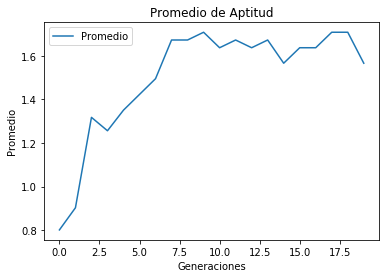 | 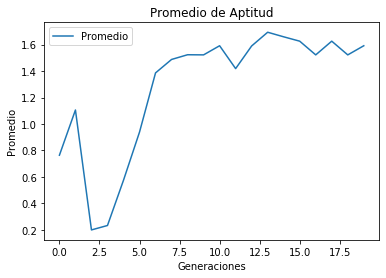 | 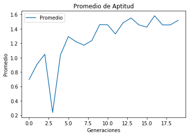 |
| Sustituciones | 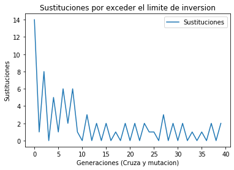 | 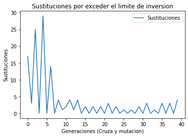 | 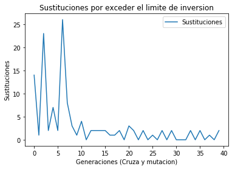 |

### Cruza modificada, Tasa de cruza: 50% , Tasa de mutación: 1%

| Descripción | Ejecución 1 | Ejecución 2 | Ejecución 3 |
| - | - | -  | - |
| Promedio | 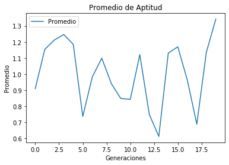 | 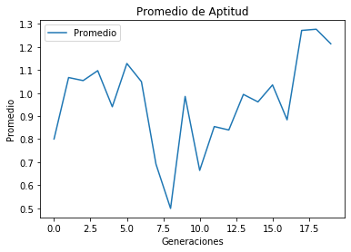 | 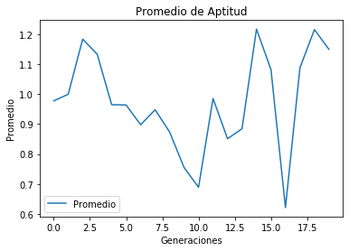 |
| Sustituciones | 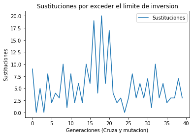 | 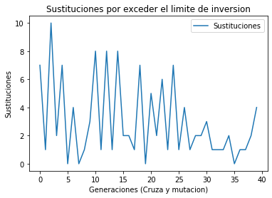 | 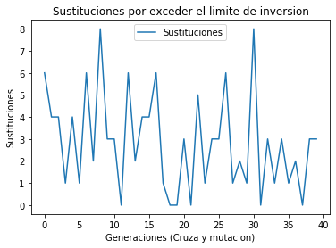 |

### Cruza modificada, Tasa de cruza: 25% , Tasa de mutación: 1%

| Descripción | Ejecución 1 | Ejecución 2 | Ejecución 3 |
| - | - | -  | - |
| Promedio | 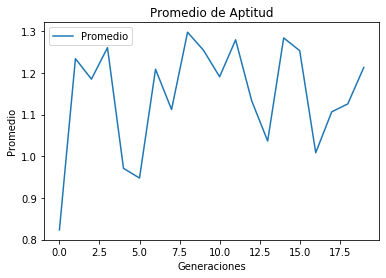 | 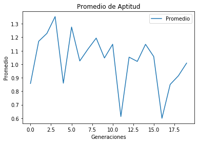 | 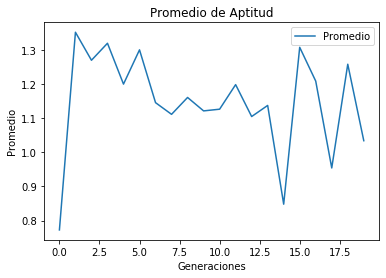 |
| Sustituciones | 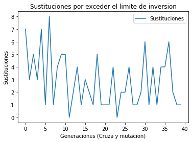 | 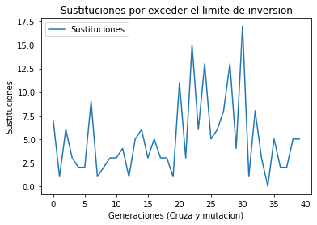 | 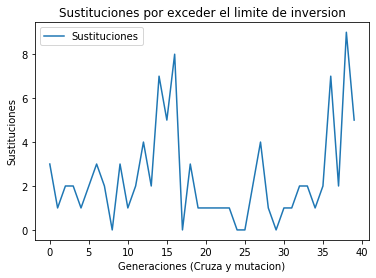 |

### Mutación modificada, Tasa de cruza: 80% , Tasa de mutación: 10%

| Descripción | Ejecución 1 | Ejecución 2 | Ejecución 3 |
| - | - | -  | - |
| Promedio | 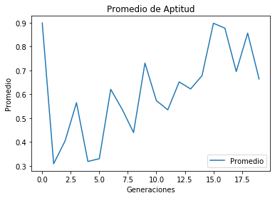 | 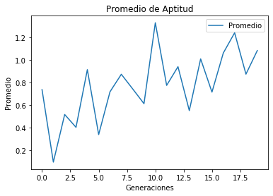 | 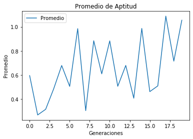 |
| Sustituciones | 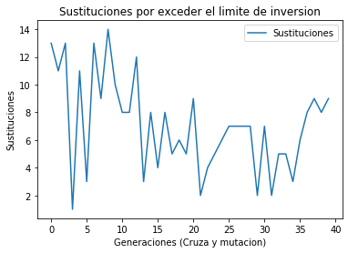 | 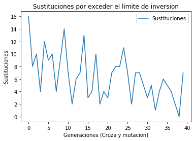 | 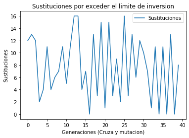 |

### Mutación modificada, Tasa de cruza: 80% , Tasa de mutación: 25%

| Descripción | Ejecución 1 | Ejecución 2 | Ejecución 3 |
| - | - | -  | - |
| Promedio | 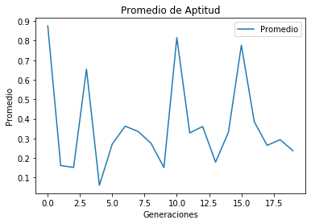 | 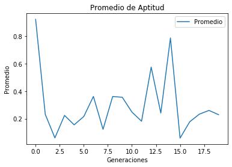 | 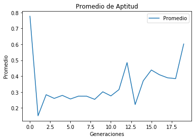 |
| Sustituciones | 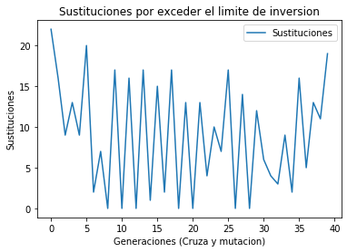 | 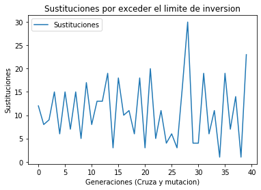 | 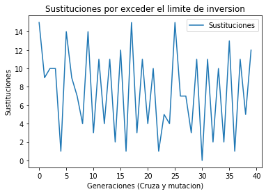 |

### Cruza y mutación modificadas, Tasa de cruza: 25% , Tasa de mutación: 25%

| Descripción | Promedio | Sustituciones |
| - | - | -  |
| Tasa de cruza 50%   Tasa de mutación 10% |  |  |
| Tasa de cruza 25%   Tasa de mutación 25% | 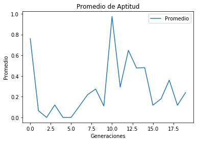 | 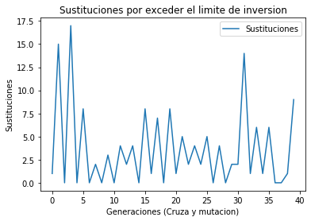 |

## Conclusiones

- __Aguilar Enriquez Paul Sebastian:__ - 
- __Cabrera Lopez Oscar Emilio:__ -

## Bibliografia

- Apuntes de la clase.
