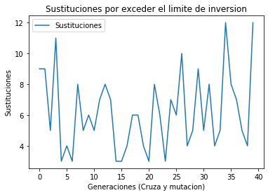

# Objetivo

El alumno programará un algoritmo genético con la finalidad de maximizar
una función, el alumno conocerá los efectos de la tasa de cruza y
mutación.

# Introducción

Los algoritmos genéticos forman parte del conjunto de técnicas de
computo evolutivo que se inspiran en la evolución biológica y la
mutación genética.

Normalmente estos algoritmos crean una población inicial (conjunto de
soluciones) de las cuales elige solo a las mejores y descarta las
restantes.

Los algoritmos genéticos se destacan por que además aplica la mutación y
la cruza de estas soluciones seleccionadas en base a su aptitud.

Para poder simular la mutación y la cruza en los algoritmos genéticos
usualmente se usa una representación binaria de las soluciones. De esta
forma una cadena de bits puede interpretarse como un cromosoma, una
posición de la cadena como un gen y el valor que toma este gen se
interpreta como un alelo.

Así iterando en varias generaciones la selección, cruza y mutación del
conjunto de soluciones se puede llegar a una solución satisfactoria de
un problema.

La naturaleza aleatoria de los algoritmos evolutivos hace que sólo sean
recomendables para resolver problemas de optimización donde el espacio
de búsqueda es enorme y la función a optimizar tiene muchos mínimos o
máximos locales.

# Desarrollo

La practica se desarrollo con `python 3.7` en un notebook. En esta
carpeta se pueden encontrar ambos.

Para la ejecución del programa se requiere tener instalados los paquetes
`random` y `matplotlib`.

El programa se puede ejecutar en la terminal con `python ag.py` o
directamente con el notebook `ag.ipynb`

Para el desarrollo del programa se utilizo la secuencia de pasos y
parámetros realizados en el ejercicio visto en clase con algunas
adecuaciones.

Durante el desarrollo pudimos observar que al cruzar y mutar individuos
estos podían resultar con valores que excedían los establecidos como la
regla de inversión máxima de 10 millones de unidades, por lo cual se
tuvieron que añadir algunas validaciones entre procesos para evitar que
estos individuos causaran problemas en el código.

Los **parámetros** utilizados fueron:

-   **Número de genes:** 16
-   **Método de selección:** Ruleta
-   **Cruza:** De 2 puntos , crossover\_rate(pc) = 80%
-   **Mutación:** mutation\_rate(pm) = 1%
-   **Tamaño de población:** 50
-   **Cantidad de generaciones:** 20

Le secuencia de **pasos ejecutados** fue:

-   **Generar población:** Generamos aleatoriamente la población.
-   **Evaluación:** Hacemos una primera evaluación para obtener la
    aptitud de los individuos.
-   **Selección:** Hacemos una ronda de selecciona de los individuos con
    los que operaremos la cruza y la mutación. Estos se seleccionan a
    partir de r's generadas de manera aleatoria. **Se utilizo el método
    de ruleta.**
-   **Configurar población seleccionada:** Aquí se re-configura la
    población seleccionada, esto es, volver nuestra población principal
    considerando los individuos seleccionados en la ruleta.
-   **Cruza:** Aplicamos el procedimiento de cruza.
-   **Validar población:** Verificamos que los individuos que resultaron
    de la cruza no han rebasado la condición limite de inversión (10
    millones de unidades distribuidas para la inversión). En caso de
    haberlo excedido, estos individuos son sustituidos primeramente por
    un valor de ceros `[0, 0, 0, 0]` el cual genera cero ganancias,
    básicamente se vuelven elementos neutros en el proceso.
    Posteriormente los individuos que se volvieron neutros son
    reemplazados por el mejor individuo hasta el momento en la
    población.
-   **Mutación:** Aplicamos el procedimiento de mutación.
-   **Validar población:** Idéntico al proceso de validación que se
    realiza posterior al proceso de cruza.
-   **Mejor individuo:** Indicamos cual es el mejor individuo al final
    de todos los pasos.

# Resultados

A continuación se muestra una serie de ejecuciones del algoritmo con
diferentes parámetros, la primera fila de cada tabla corresponde al
promedio de la aptitudes conforme las generaciones y la segunda a las
sustituciones de individuos que se tuvieron que realizar cuando estos
excedían el limite de unidades a invertir.

## Parámetros iniciales, Tasa de cruza: 80% , Tasa de mutación: 1%

| Descripción | Ejecución 1 | Ejecución 2 | Ejecución 3 |
| - | - | -  | - |
| Promedio |  |  |  |
| Sustituciones |  |  |  |

## Cruza modificada, Tasa de cruza: 50% , Tasa de mutación: 1%

| Descripción | Ejecución 1 | Ejecución 2 | Ejecución 3 |
| - | - | -  | - |
| Promedio |  |  |  |
| Sustituciones |  |  |  |

## Cruza modificada, Tasa de cruza: 25% , Tasa de mutación: 1%

| Descripción | Ejecución 1 | Ejecución 2 | Ejecución 3 |
| - | - | -  | - |
| Promedio |  |  |  |
| Sustituciones |  |  |  |

## Mutación modificada, Tasa de cruza: 80% , Tasa de mutación: 10%

| Descripción | Ejecución 1 | Ejecución 2 | Ejecución 3 |
| - | - | -  | - |
| Promedio |  |  |  |
| Sustituciones |  |  |  |

## Mutación modificada, Tasa de cruza: 80% , Tasa de mutación: 25%

| Descripción | Ejecución 1 | Ejecución 2 | Ejecución 3 |
| - | - | -  | - |
| Promedio |  |  |  |
| Sustituciones |  |  |  |

## Cruza y mutación modificadas, Tasa de cruza: 25% , Tasa de mutación: 25%

| Descripción | Promedio | Sustituciones |
| - | - | -  |
| Tasa de cruza 50%   Tasa de mutación 10% |  |  |
| Tasa de cruza 25%   Tasa de mutación 25% |  |  |

# Conclusiones

## Aguilar Enriquez Paul Sebastian

La selección de valores adecuados para los parámetros de cruza y
mutación son importantes. Como vimos en los resultados el rendimiento
del algoritmo varia bastante función de estos parámetros.

En el caso de la cruza se observo que con una tasa del 50% el algoritmo
lograba maximizar la función al final pero con un rendimiento no tan
bueno, y en el caso del 25% no se logro maximizar la función y se obtuvo
un rendimiento nada bueno. En ambos casos la cantidad de individuos que
se tuvieron que reemplazar porque excedían el limite de inversión
también se vio afectado de manera proporcional.

En el caso de la mutación podemos ver que conforme esta incrementa
aumenta también el ruido en la población. Con una tasa de 10% los
individuos comienzan a variar de forma constante incrementando las
sustituciones, y con una tasa de 25% las variaciones ya son demasiadas,
a tal punto de que es necesario realizar sustituciones grandes en cada
generación.

Con menor posibilidad de cruza entre individuos más variedad de
individuos existen, lo cual no permite estabilizar la población con un
individuo óptimo.

Con mayor posibilidad de mutación los individuos varían más y suelen
romper con mayor frecuencia la restricción de inversión, por lo cual hay
mas sustituciones provocando que la función no se maximice ni se
estabilice.

Recomendación, mayor posibilidad de cruza y mejor posibilidad de
mutación.

## Cabrera Lopez Oscar Emilio

Los algoritmos genéticos son un campo bastante interesante de la
computación por su forma de resolver los problemas de optimización.

Sin embargo son complicados de dominar ya que hiperparámetros como la
tasa de cruza y la probabilidad de mutación afectan mucho la solución a
la que se llegará y no es posible encontrar un valor adecuado para estos
ya que dependen completamente del espacio de búsqueda, el cuál no es
conocido en los problemas en los que son útiles estos algoritmos.

Esto hace necesario realizar varias corridas para determinar que valor
de hiperparámetros es más adecuado para el problema, lo que es caro
computacionalmente. Por ello solo son recomendables en aquellos
problemas no han logrado ser optimizados por otros métodos de
aprendizaje máquina de forma satisfactoria.

# Referencias

-   Apuntes de la clase.
-   Algoritmo genético. (2019, 5 de octubre). Wikipedia, La enciclopedia
    libre. Fecha de consulta: 02:48, noviembre 17, 2019 desde
    <https://es.wikipedia.org/w/index.php?title=Algoritmo_gen%C3%A9tico&oldid=119969660>
